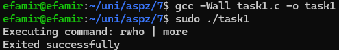

# Практична 7
### Виконав студент групи ТВ-33 Козінченко Тимофій
## Завдання 1
Використайте popen(), щоб передати вивід команди rwho (команда UNIX) до more (команда UNIX) у програмі на C.
### Виконання 
Використовуємо popen, щоб виконати команду ```rwho | more```, ```|``` тут бере 
вивід команти rwho на вхід команді more, popen повертає вказівник на результат виконання цієї команди. Після чого,
ми перевіряємо чи він не NULL (також ще потім перевіряємо статус закриття pipe завдяки ```pclose(fp);```), що б свідчило про неправильне виконання.<br>
Код до програми: [task1.c](task1.c)
<br>
**Вивід програми:**
<br>

<br>

## Завдання 2
Напишіть програму мовою C, яка імітує команду ls -l в UNIX — виводить список усіх файлів у поточному каталозі та перелічує права доступу тощо.
(Варіант вирішення, що просто виконує ls -l із вашої програми, — не підходить.)
### Виконання
Ми відкриваємо поточний каталог (.) за допомогою системного виклику opendir(). 
У циклі readdir() ми читаємо кожен файл або підкаталог у каталозі. 
Для кожного запису викликаємо lstat() для отримання інформації про файл/каталог у структуру stat. 
З цієї структури витягуємо тип файлу та права доступу, кількість жорстких посилань, ID власника та групи 
(потім конвертуємо в імена за допомогою getpwuid() та getgrgid()), розмір файлу та час останньої модифікації. 
Отримані дані виводимо. Після виконання закриваємо каталог викликом closedir().<br>
Код до програми: [task2.c](task2.c)
<br>
**Вивід програми:**
<br>

<br>

## Завдання 3
Напишіть програму, яка друкує рядки з файлу, що містять слово, передане як аргумент програми 
(проста версія утиліти grep в UNIX).
### Виконання
Програма очікує два аргументи: слово для пошуку та ім'я файлу.
Спершу перевіряємо, чи передалась правильна кількість аргументів.
Далі намагаємося відкрити вказаний файл за допомогою функції fopen(). Перевіряємо на помилку (якщо файл не знайдено чи немає прав).
Якщо файл успішно відкрито, ми читаємо його рядок за рядком у буфер за допомогою функції fgets().
Використовуємо функцію strstr(), щоб перевірити, чи містить цей рядок шукане слово.
Якщо strstr() знаходить слово (повертає не NULL), то весь поточний рядок друкується.
Після завершення читання файл закривається за допомогою fclose().<br>
Код до програми: [task3.c](task3.c)
<br>
**Вивід програми:**
<br>

<br>

## Завдання 4
Напишіть програму, яка виводить список файлів, заданих у вигляді аргументів, з зупинкою кожні 20 рядків, 
доки не буде натиснута клавіша (спрощена версія утиліти more в UNIX).
### Виконання
Спершу вона перевіряє, чи передано хоча б один файл (argc >= 2).
Далі програма проходить по всіх аргументах командного рядка (argv\[1], argv\[2], ...). Для кожного файлу 
викликається окрема функція display_file.
Функція display_file намагається відкрити вказаний файл для читання ("r") за допомогою fopen(). 
Якщо виникає помилка, виводить повідомлення про помилку за допомогою perror() і переходить до наступного файлу (якщо є).
Якщо файл успішно відкрито, читає файл рядок за рядком за допомогою fgets().
Якщо ліміт лічильника рядків досягнуто:
Виводить --More-- (Press Enter to continue).
Використовує getchar() для очікування натискання клавіші Enter користувачем.
Після прочитання всіх рядків файлу, закриває його за допомогою fclose().<br>
Код до програми: [task4.c](task4.c)
<br>
**Вивід програми:**
<br>


<br>

## Завдання 5
Напишіть програму, яка перелічує всі файли в поточному каталозі та всі файли в підкаталогах.
### Виконання
Функція list_directory приймає шлях:
Відкриває каталог за цим шляхом (opendir). У разі помилки виводить повідомлення і завершує роботу з цим каталогом.
Читає вміст каталогу запис за записом (readdir) у циклі.
Ігнорує спеціальні записи . (поточний каталог) та .. (батьківський каталог), щоб уникнути нескінченної рекурсії.
Для кожного іншого запису:
1. Формує повний шлях до цього запису.
2. Виводить цей повний шлях на екран.
3. Використовує stat, щоб отримати інформацію про запис (наприклад чи є він каталогом).
4. Якщо запис виявляється каталогом, рекурсивно викликає саму себе (list_directory) для цього підкаталогу, передаючи новий повний шлях.
5. Після обробки всіх записів закриває поточний каталог (closedir).<br>

Код до програми: [task5.c](task5.c)
<br>
**Вивід програми:**
<br>

<br>

## Завдання 6
Напишіть програму, яка перелічує лише підкаталоги у алфавітному порядку.
### Виконання
Програма виконує наступні кроки:
1. Відкриває поточний каталог (.) за допомогою opendir. Перевіряє на помилку.
2. Створює динамічний масив (subdir_names) для зберігання імен знайдених підкаталогів.
3. Читає вміст каталогу запис за записом (readdir) у циклі.
4. Для кожного запису:
  - Ігнорує . та ... 
  - Використовує stat, щоб отримати інформацію про запис.
- Перевіряє, чи є запис каталогом (S_ISDIR).
- Якщо це каталог, його ім'я (entry->d_name) копіюється (strdup) і додається до динамічного масиву subdir_names. Розмір масиву збільшується при необхідності (realloc).
5. Після прочитання всіх записів закриває каталог (closedir).
6. Сортує масив імен підкаталогів subdir_names в алфавітному порядку за допомогою стандартної функції qsort та власної функції порівняння compare_strings.
7. Виводить відсортовані імена підкаталогів на екран.
8. Звільняє пам'ять, виділену для кожного імені каталогу (free для кожного результату strdup), а потім звільняє сам масив вказівників (free(subdir_names)).

Код до програми: [task6.c](task6.c)
<br>
**Вивід програми:**
<br>

<br>


## Завдання 7
Напишіть програму, яка показує користувачу всі його/її вихідні програми на C, а потім в інтерактивному режимі запитує, 
чи потрібно надати іншим дозвіл на читання (read permission); у разі ствердної відповіді — такий дозвіл повинен бути наданий.
### Виконання
Функція main спочатку отримує ID поточного користувача (getuid()). Потім вона викликає find_and_process_c_sources, 
передаючи їй поточний каталог (.) та ID користувача, для пошуку всіх файлів .c, що належать цьому користувачеві.
<br>
Функція find_and_process_c_sources рекурсивно обходить каталоги (opendir, readdir). Для кожного елемента вона перевіряє 
його атрибути (stat). Якщо це підкаталог, пошук продовжується в ньому. Якщо це звичайний файл (S_ISREG), що належить 
користувачеві (statbuf.st_uid) і має розширення .c (визначене через strrchr та strcmp), то для цього файлу викликається 
функція зміни прав.
<br>
Функція ask_and_set_read_permission спершу перевіряє, чи файл вже має дозвіл на читання для інших (S_IROTH). Якщо ні, 
вона запитує згоду користувача (fgets, tolower). За позитивної відповіді ('y'), до поточних прав файлу додається прапор 
S_IROTH (currentMode | S_IROTH), і нові права встановлюються за допомогою chmod.<br>
код до програми: [task7.c](task7.c)
<br>
**Вивід програми:**
<br>

<br>


## Завдання 8
Напишіть програму, яка надає користувачу можливість видалити будь-який або всі файли у поточному робочому каталозі. 
Має з’являтися ім’я файлу з запитом, чи слід його видалити.
### Виконання
Програма починає з відкриття поточного робочого каталогу (.) за допомогою opendir. Далі, у циклі, вона переглядає кожен 
елемент каталогу, отриманий через readdir. Спеціальні каталоги . та .. пропускаються. 
Для кожного іншого елемента, за допомогою stat, програма перевіряє, чи є він звичайним файлом (S_ISREG).
<br>
Якщо елемент є файлом, його ім'я виводиться на екран, і користувача запитують, чи слід видалити цей файл (y/n).
Відповідь зчитується функцією fgets. У разі позитивної відповіді ('y'), файл видаляється системним викликом remove(). 
Після перебору всіх елементів, каталог закривається (closedir). 
Таким чином, користувач може видалити будь-який обраний файл або, послідовно погоджуючись, видалити всі файли.
<br>
код до програми: [task8.c](task8.c)
<br>
**Вивід програми:**
<br>

<br>


## Завдання 9
Напишіть програму на C, яка вимірює час виконання фрагмента коду в мілісекундах.
### Виконання
Для точного вимірювання використовується clock_gettime з годинником CLOCK_MONOTONIC. Цей годинник не залежить від змін системного часу, що забезпечує коректність вимірювань. Час фіксується у структурах struct timespec, що містять секунди та наносекунди.
<br>
Перед виконанням цільового фрагменту коду фіксується початковий час (time_start). Після завершення роботи цього фрагменту (в прикладі це цикл, що виконує просту операцію) фіксується кінцевий час (time_end).
<br>
Різниця між кінцевим та початковим часом обчислюється окремо для секунд та наносекунд, з урахуванням можливого перенесення з наносекунд у секунди. Отриманий результат переводиться в мілісекунди: (різниця_секунд * 1000) + (різниця_наносекунд / 1000000).
<br>
код до програми: [task9.c](task9.c)
<br>
**Вивід програми:**
<br>

<br>

## Завдання 10
Напишіть програму мовою C для створення послідовності випадкових чисел з плаваючою комою у діапазонах:<br>
(a) від 0.0 до 1.0<br>
(b) від 0.0 до n, де n — будь-яке дійсне число з плаваючою точкою.<br>
Початкове значення генератора випадкових чисел має бути встановлене так, щоб гарантувати унікальну послідовність.
### Виконання
Генератор випадкових чисел ініціалізується (srand) поточним системним часом (time(NULL)).
<br>
Випадкове число у проміжку [0, 1] отримується діленням значення, повернутого rand() (яке є цілим числом від 0 до RAND_MAX), на константу RAND_MAX. Щоб результат був типу double (з плаваючою комою), rand() перед діленням приводиться до цього типу: (double)rand() / RAND_MAX.
<br>
Для отримання випадкового числа в діапазоні від 0 до числа, введеного користувачем, значення, отримане як випадкове число в діапазоні [0, 1], множиться на число користувача. Формула: ((double)rand() / RAND_MAX) * n. Програма запитує значення n у користувача. Якщо n від'ємне, числа генеруватимуться в діапазоні [n, 0].
<br>
код до програми: [task10.c](task10.c)
<br>
**Вивід програми:**
<br>

<br>

## Завдання 11 (8 Варіант)
Реалізуйте функціонал cron, який не використовує жодного фону або демонів.
### Виконання
На початку програма завантажує завдання з файлу mycron.tab, розташованого в поточному каталозі. Кожен рядок у цьому файлі повинен містити інтервал виконання у секундах, за яким слідує команда, яку потрібно виконати (наприклад: 3 ../script.sh). Порожні рядки та рядки, що починаються з символу # (коментарі), ігноруються. Під час завантаження, для кожного завдання час його "останнього запуску" ініціалізується так, щоб завдання могло виконатися якомога швидше після старту програми, як тільки мине його перший визначений інтервал.
<br>
Після завантаження завдань програма входить у нескінченний цикл. У кожній ітерації циклу вона отримує поточний системний час (time). Потім для кожного завантаженого завдання перевіряється, чи минув вказаний для нього інтервал з моменту його останнього виконання. Це робиться шляхом порівняння поточного часу з сумою часу останнього запуску та інтервалу завдання (current_time >= last_run_time + interval_seconds). Якщо умова виконується, вказана команда запускається за допомогою системного виклику system(), а час останнього запуску для цього завдання оновлюється на поточний. Після перевірки всіх завдань програма "засинає" на одну секунду (sleep(1)) перед наступною ітерацією, щоб уникнути надмірного навантаження на процесор.
<br>
код до програми: [task11.c](task11.c)
<br>
**Вивід програми:**
<br>

<br>
