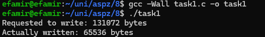

# Практична 7
### Виконав студент групи ТВ-33 Козінченко Тимофій
## Завдання 1
Чи може виклик count = write(fd, buffer, nbytes); повернути в змінній count значення, відмінне від nbytes? 
Якщо так, то чому? Наведіть робочий приклад програми, яка демонструє вашу відповідь.
### Виконання
Для демонстрації чому відповідь на питання буде "Так", я вирішив використати канал (pipe), бо в нього є обмежений буфер 
(у Linux зазвичай 64 КБ), і це зручно для демонстрації часткового записування.

Спочатку я створюю канал за допомогою pipe(pipefd). Це дає два дескриптори: один для читання (pipefd[0]) і один для запису (pipefd[1]). Щоб write не зависав, коли буфер заповниться, я встановлюю неблокуючий режим через fcntl(pipefd[1], F_SETFL, O_NONBLOCK). Це дозволяє write одразу повертати кількість записаних байтів, навіть якщо не всі дані помістилися.

Далі виділяю буфер на 128 КБ і заповнюю його символами 'A'. Розмір буфера спеціально більший за буфер каналу, щоб write точно не зміг записати все. Потім викликаю write(pipefd[1], buffer, nbytes) і зберігаю результат у змінну count. У неблокуючому режимі write записує тільки те, що вміщається в буфер каналу, зазвичай 64 КБ.

Після цього виводжу на екран, скільки байтів планувалося записати (nbytes) і скільки реально записалося (count). У моєму випадку вийшло: Requested to write: 131072 bytes, Actually written: 65536 bytes. Це показує, що write дійсно може повернути менше, ніж запитували, через обмеження буфера каналу.
 
Код до програми: [task1.c](task1.c)
 
**Вивід програми:**
 

 

## Завдання 2
Є файл, дескриптор якого — fd. Файл містить таку послідовність байтів: 4, 5, 2, 2, 3, 3, 7, 9, 1, 5. У програмі виконується наступна послідовність системних викликів:
lseek(fd, 3, SEEK_SET);
read(fd, &buffer, 4);
де виклик lseek переміщує покажчик на третій байт файлу. Що буде містити буфер після завершення виклику read? Наведіть робочий приклад програми, яка демонструє вашу відповідь.
### Виконання
Виклик lseek(fd, 3, SEEK_SET) переміщує покажчик файлу на позицію 3 (нумерація з 0), тобто на четвертий байт файлу. У файлі байти: 4, 5, 2, 2, 3, 3, 7, 9, 1, 5. Після lseek покажчик вказує на байт 2 (позиція 3). Далі виклик read(fd, &buffer, 4) зчитує 4 байти, починаючи з поточної позиції, тобто байти 2, 3, 3, 7. Отже, буфер міститиме послідовність: [2, 3, 3, 7].

У коді до завдання я зробив як було сказано у завданні. вивід дійсно збігся із моєю відповіддю.
 
Код до програми: [task2.c](task2.c)
 
**Вивід програми:**
 

 

## Завдання 3
Бібліотечна функція qsort призначена для сортування даних будь-якого типу. Для її роботи необхідно підготувати функцію порівняння, яка викликається з qsort кожного разу, коли потрібно порівняти два значення.
Оскільки значення можуть мати будь-який тип, у функцію порівняння передаються два вказівники типу void* на елементи, що порівнюються.
Напишіть програму, яка досліджує, які вхідні дані є найгіршими для алгоритму швидкого сортування. Спробуйте знайти кілька масивів даних, які змушують qsort працювати якнайповільніше. Автоматизуйте процес експериментування так, щоб підбір і аналіз вхідних даних виконувалися самостійно.

Придумайте і реалізуйте набір тестів для перевірки правильності функції qsort.

### Виконання
Для початку я створив функцію порівняння cmp_int, яка віднімає два числа, щоб qsort знав, як порівнювати елементи. Додав глобальний лічильник comparisons, щоб підраховувати, скільки разів викликається ця функція, бо це допомагає оцінити, наскільки важким є масив для сортування. Функція measure_qsort_time вимірює час виконання qsort за допомогою clock_gettime для точності і записує кількість порівнянь. Щоб не змінювати оригінальний масив, я копіюю його в тимчасовий перед сортуванням.

Для експериментів узяв масив на 1000000 елементів, щоб різниця в часі і порівняннях була помітною. Кожен тест запускаю 5 разів і виводжу середній час та кількість порівнянь. Тестую п’ять типів масивів: відсортований (0, 1, 2, ...), зворотньо відсортований (1000000, 999999, ...), усі елементи однакові (усі 42), випадковий (згенерований через rand) і "обманний" масив, який чергуватиме великі і малі значення (0, 1000000, 2, 999998, ...). Для кожного типу заповнюю масив, сортую і виводжу результати. У мене випадковий масив виявився найповільнішим (0.114524 секунд, ~18.7M порівнянь), а відсортовані та однакові масиви — швидшими (~0.026-0.030 секунд, ~9.9-10M порівнянь). "Обманний" масив був посередині (~0.039 секунд, ~14.9M порівнянь).

Щоб перевірити, чи qsort працює правильно, написав функцію run_tests. Вона тестує чотири випадки: випадковий масив (5, 2, 8, 1, 9), порожній масив, масив із однаковими елементами (4, 4, 4, 4) і зворотньо відсортований (10, 9, 8, 7, 6). Після сортування перевіряю через функцію is_sorted, чи масив упорядкований, і виводжу, чи тест пройшов. Усі тести пройшли, значить, qsort працює коректно.

Тестував лише на цілих числах, бо тип даних не впливає на поведінку qsort, адже вона працює через вказівники і функцію порівняння. Результати показують, що qsort у моїй системі дуже оптимізований, бо відсортовані масиви, які мали бути найгіршими, обробляються швидше за випадкові.
 
Код до програми: [task3.c](task3.c)
 
**Вивід програми:**
 

 

## Завдання 4
Виконайте наступну програму на мові програмування С: 
int main() { 
....int pid; 
....pid = fork(); 
....printf("%d\n", pid); 
} 
Завершіть цю програму. Припускаючи, що виклик fork() був успішним, яким може бути результат виконання цієї програми?

### Виконання
Припускаючи, що виклик fork() успішний, програма створює два процеси: батьківський і дочірній. Значення pid і вивід залежать від того, який процес виконується:

Батьківський процес: 
fork() повертає PID (позитивне число) дочірнього процесу.
    Наприклад, якщо дочірній процес має PID 1234, батьківський процес виведе: 1234.
 Дочірній процес: 
    fork() повертає 0 у дочірньому процесі.
    Дочірній процес виведе: 0.

Оскільки обидва процеси викликають printf, програма виведе два рядки, що і підтверджується виконанням програми.
 
Код до програми: [task4.c](task4.c)
 
**Вивід програми:**
 

 

## Завдання 5 (Варіан 8)
Напишіть тестовий фреймворк, який досліджує, як працює lseek() з файлами /dev/null та /dev/zero.

### Виконання
Код включає функцію run_lseek_test, яка відкриває пристрій, викликає lseek() із різними параметрами і перевіряє читання. У main запускаю тести для SEEK_SET (1000, -1000), SEEK_CUR (500), SEEK_END (100) і запис після lseek, виводячи результати.
 
Код до програми: [task5.c](task5.c)
 
**Вивід програми:**
 

 
Тести перевіряли SEEK_SET (зміщення 1000 і -1000), SEEK_CUR (500), SEEK_END (100) і запис після lseek. Результати: SEEK_SET і SEEK_CUR із позитивними зміщеннями повертають правильні позиції (1000, 500), але SEEK_SET negative і SEEK_END не видають помилок, хоча мали б (EINVAL). Читання працює коректно: /dev/null повертає 0 байтів, /dev/zero — 1 байт (0). Запис успішний для обох, повертає 4 байти. FreeBSD, схоже, ігнорує деякі помилки lseek(), але читання/запис поводяться очікувано.