# Практична 9
### Виконав студент групи ТВ-33 Козінченко Тимофій
## Завдання 1
Напишіть програму, яка читає файл /etc/passwd за допомогою команди getent passwd, щоб дізнатись, які облікові записи визначені на вашому комп’ютері.
Програма повинна визначити, чи є серед них звичайні користувачі (ідентифікатори UID повинні бути більші за 500 або 1000, залежно від вашого дистрибутива), окрім вас.
### Виконання
Програма використовує команду getent passwd для отримання інформації про облікові записи з файлу /etc/passwd. Вона аналізує кожен рядок, витягує UID та ім’я користувача, перевіряє, чи є користувач звичайним (UID >= 1000), і виключає поточного користувача, отриманого через getenv("USER"). Обробка помилок включає перевірку коректності виконання popen та правильності формату рядків. Вивід містить імена звичайних користувачів або повідомлення про їх відсутність.
 
Код до програми: [task1.c](task1.c)
 
**Вивід програми:**
 
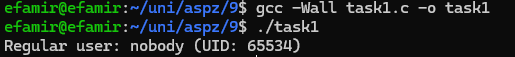
 
Вивід свідчить, що на комп'ютері є лише один звичайний користувач "nobody" з UID 65534, який є системним і зазвичай використовується для процесів із мінімальними привілеями.

## Завдання 2
Напишіть програму, яка виконує команду cat /etc/shadow від імені адміністратора, хоча запускається від звичайного користувача.
(Ваша програма повинна робити необхідне, виходячи з того, що конфігурація системи дозволяє отримувати адміністративний доступ за допомогою відповідної команди.)
### Виконання
Програма виконує команду sudo cat /etc/shadow за допомогою system(). Виклик sudo дозволяє отримати адміністративні права "на ходу", якщо користувач має відповідні дозволи в конфігурації sudoers. Якщо sudo вимагає пароль, користувач вводить його під час виконання. Обробка помилок перевіряє результат виконання команди.
 
Код до програми: [task2.c](task2.c)
 
**Вивід програми:**
 
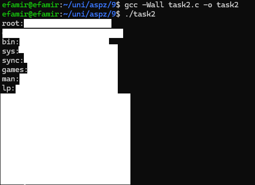
 

## Завдання 3
Напишіть програму, яка від імені root копіює файл, який вона перед цим створила від імені звичайного користувача. Потім вона повинна помістити копію у домашній каталог звичайного користувача.
Далі, використовуючи звичайний обліковий запис, програма намагається змінити файл і зберегти зміни. Що відбудеться?
Після цього програма намагається видалити цей файл за допомогою команди rm. Що відбудеться?
### Виконання
Програма виконує кілька етапів:
- Від імені звичайного користувача створює файл у тимчасовій директорії (/tmp).
- Використовуючи sudo, від імені root копіює цей файл у домашній каталог користувача.
- Від імені звичайного користувача намагається змінити вміст скопійованого файлу.
- Намагається видалити скопійований файл за допомогою команди rm.

Код до програми: [task3.c](task3.c)
 
**Вивід програми:**
 
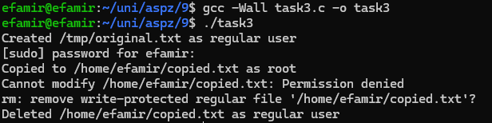
 
Аналіз виводу:
- Створено /tmp/original.txt від користувача efamir — успішно, /tmp дозволяє запис.
- Скопійовано до /home/efamir/copied.txt через sudo — успішно, файл належить root.
- Модифікація copied.txt — невдача, Permission denied, бо efamir не має прав на запис.
- Видалення copied.txt — успішно після підтвердження, бо efamir має права на запис у /home/efamir.

Відповіді:
- Модифікація: Неможлива через брак прав на запис (власник root).
- Видалення: Успішне, бо користувач контролює домашню директорію.

## Завдання 4
Напишіть програму, яка по черзі виконує команди whoami та id, щоб перевірити стан облікового запису користувача, від імені якого вона запущена.
Є ймовірність, що команда id виведе список різних груп, до яких ви належите. Програма повинна це продемонструвати.
### Виконання
Програма виконує команди whoami та id по черзі, щоб перевірити стан облікового запису користувача. Команда whoami виводить ім’я поточного користувача, а id показує UID, GID та список груп, до яких належить користувач. Програма використовує system() для виконання команд. Вивід команд демонструє ім’я користувача та деталі груп, якщо вони є.
 
Код до програми: [task4.c](task4.c)
 
**Вивід програми:**
 
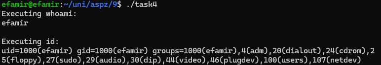
 

## Завдання 5
Напишіть програму, яка створює тимчасовий файл від імені звичайного користувача. Потім від імені суперкористувача використовує команди chown і chmod, щоб змінити тип володіння та права доступу.
Програма повинна визначити, в яких випадках вона може виконувати читання та запис файлу, використовуючи свій обліковий запис.
### Виконання
Щоб перевіряти доступ, я написав окрему функцію check_access, яка просто намагається відкрити файл на читання, а потім на дозапис, і повідомляє про результат. У головній функції main я створив тимчасовий файл, одразу перевірив доступ до нього, що показало повні права.

Далі, для зміни власника та прав доступу від імені суперкористувача, я використав функцію system() з командами sudo chown та sudo chmod. Після кожної такої операції (зміна власника на nobody і прав на 600, потім прав на 400, і нарешті на 000), я знову викликав check_access, щоб побачити, як змінилися мої можливості читання та запису. Наприкінці я видалив файл командою sudo rm, також через system().
 
Код до програми: [task5.c](task5.c)
 
**Вивід програми:**
 
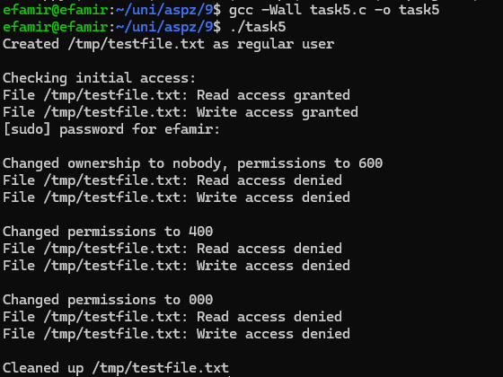
 
Вивід програми повністю відповідав очікуванням: спочатку повний доступ, а після зміни власника та звуження прав доступ зникав, як і передбачалося логікою прав доступу.

## Завдання 6
Напишіть програму, яка створює тимчасовий файл від імені звичайного користувача. Потім від імені суперкористувача використовує команди chown і chmod, щоб змінити тип володіння та права доступу.
Програма повинна визначити, в яких випадках вона може виконувати читання та запис файлу, використовуючи свій обліковий запис.
### Виконання
Щоб продемонструвати взаємодію з правами доступу, я обрав по одному характерному файлу з кожного місця: тимчасовий файл, який я сам створив у домашньому каталозі (~/my_permission_test_file.txt), системну утиліту (/usr/bin/cat) та конфігураційний файл (/etc/hosts).

Для кожного з цих файлів моя програма послідовно намагалася виконати чотири дії: відкрити на читання (fopen з режимом "r"), відкрити на дозапис (fopen з режимом "a"), перевірити можливість виконання (за допомогою access з X_OK) та змінити права доступу на 0777 (за допомогою chmod). Результати кожної спроби (успіх чи помилка з описом) виводяться на екран. Це дозволяє наочно побачити, як система реагує на спроби операцій, що можуть бути обмежені правами поточного користувача або властивостями файлу.

Очікується, що вивід програми продемонструє успішні операції читання/запису/виконання та зміни прав для файлу, створеного самим користувачем у його домашньому каталозі (оскільки він є власником). Для системних файлів, таких як /usr/bin/cat та /etc/hosts, спроби запису та зміни прав мають завершитися помилкою (Permission denied), оскільки звичайний користувач не є їх власником і не має відповідних дозволів, тоді як читання може бути дозволене, а виконання – для /usr/bin/cat, але не для /etc/hosts.
 
Код до програми: [task6.c](task6.c)
 
**Вивід програми:**
 
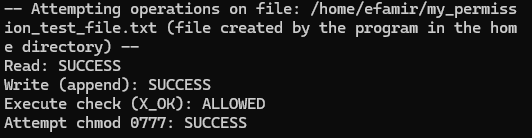
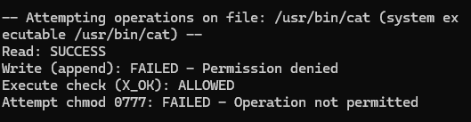
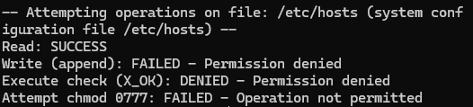
 

## Завдання 7 (8 варіант)
Створіть групу користувачів, яка має повний доступ до окремої директорії, але жоден з учасників не має доступу до неї окремо.
### Виконання
Підготовка середовища:
- Було створено групу project_alpha_group.
- Створено трьох користувачів: user1, user2 та user3, для кожного встановлено пароль.
- Користувачі user1 та user2 були додані до групи project_alpha_group.

Створення та налаштування директорії:
- Створено директорію /srv/project_alpha_data.
- Власником директорії призначено user1, а групою-власником project_alpha_group.
- Встановлено права доступу 070 (що означає d---rwx---) для директорії. Перевірка ls -ld підтвердила ці права: d---rwx--- 2 user1 project_alpha_group ... /srv/project_alpha_data.

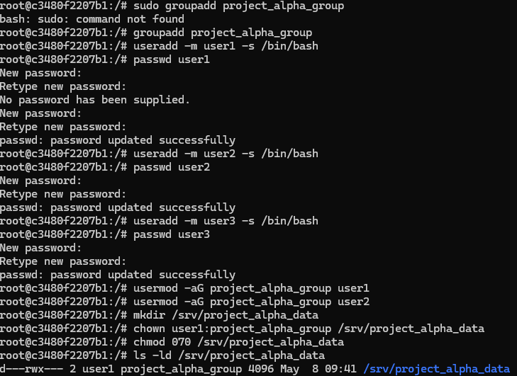 
**Перевірки прав користувачів**

Від імені user1 (член групи та власник директорії): 
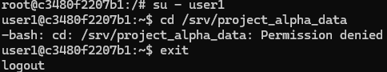 
Спроба перейти в директорію (cd /srv/project_alpha_data) завершилася помилкою "Permission denied".

Від імені user2 (член групи, але не власник): 
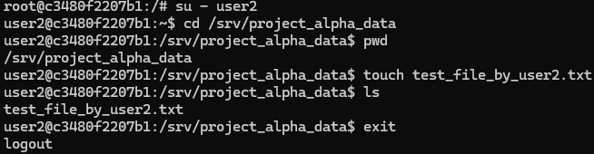
- Успішно перейшов в директорію (cd /srv/project_alpha_data).
- Успішно перевірив поточний шлях (pwd).
- Успішно створив файл (touch test_file_by_user2.txt).
- Успішно переглянув вміст директорії (ls).

Від імені user3 (не член групи і не власник): 
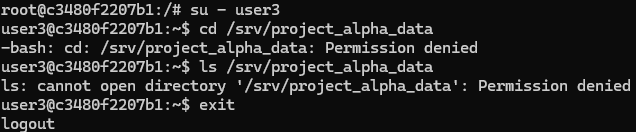
- Спроба перейти в директорію (cd /srv/project_alpha_data) завершилася помилкою "Permission denied".
- Спроба переглянути вміст директорії (ls /srv/project_alpha_data) завершилася помилкою "Permission denied".

**Пояснення:**
Права групи перевіряються тільки якщо користувач не є власником. Так як user1 є власником, проте немає прав,
на цьому перевірка закінчилась на відміну від user2 у якого перевірилась група та надався доступ.
